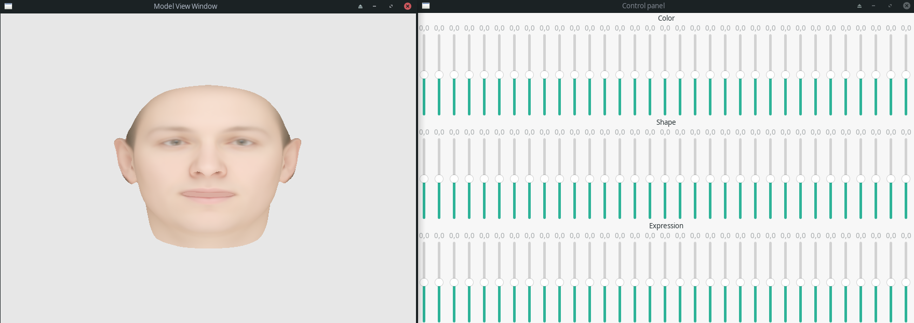
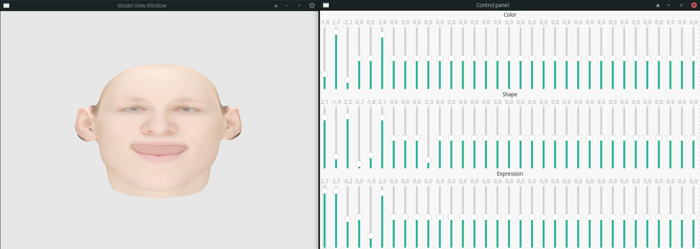

# Face Viewer

Basel Face Model 3D viewer application written in Rust.



## Getting Started

To build and run project download or clone repository and download [Basel Face Model 2019](https://faces.dmi.unibas.ch/bfm/bfm2019.html). **If you are downloading the data for private purpose, enter "private" as your institution.**

Place downloaded Basel Face Model file **model2019_bfm.h5** under ***resources/basel_face_model*** directory:
```
.
|-- Cargo.toml
|-- resources
|   `-- basel_face_model
|       `-- model2019_bfm.h5
|-- src
    |-- (...)
  (...)
```

### Prerequisites

Project is being developed with `Rust 1.53.0`.

Since Face Viewer uses [https://crates.io/crates/relm](https://github.com/antoyo/relm), [hdf5](https://crates.io/crates/hdf5) the following libraries have to be installed on your system:

1. GTK+
2. hdf5

### Installing

All following commands are executed under project root directory.

To build project in Debug mode and then run it:
```
cargo build
./target/debug/face-viewer
```
or
```
cargo run
```

To build project in Debug mode and then run it:
```
cargo build --release
./target/release/face-viewer
```
or
```
cargo run --release
```

## Running the tests **(Tests not implemented yet)**
To execute tests run:
```
cargo test
```

## Built With

* [Rust 1.53.0]()
* [glium 0.29.1]()
* [hdf5 0.7.1]()
* [nalgebra 0.27.1]()
* [ndarray 0.14.0]()
* [blas-src 0.6.1]()
* [openblas-src 0.9.0]()
* [rand 0.8.4]()
* [gtk 0.9.0]()
* [relm 0.21.0]()
* [relm-derive 0.21.0]()

## Acknowledgments

* Inspiration: [eos-model-viewer](https://github.com/patrikhuber/eos-model-viewer)
* Used model: [Basel Face Model 2019](https://faces.dmi.unibas.ch/bfm/bfm2019.html)
